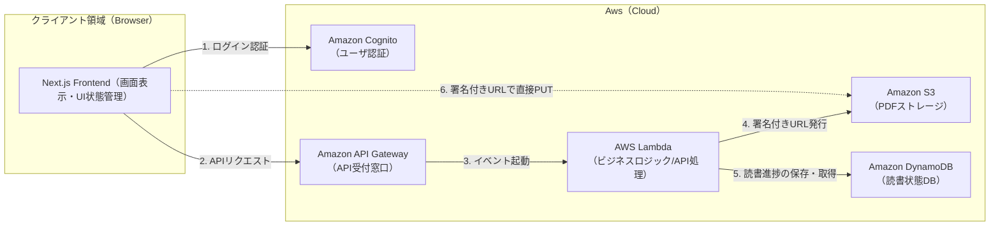
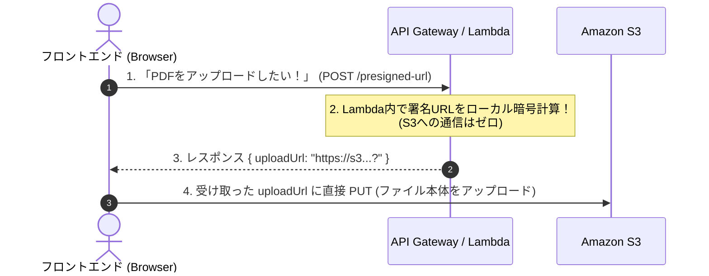
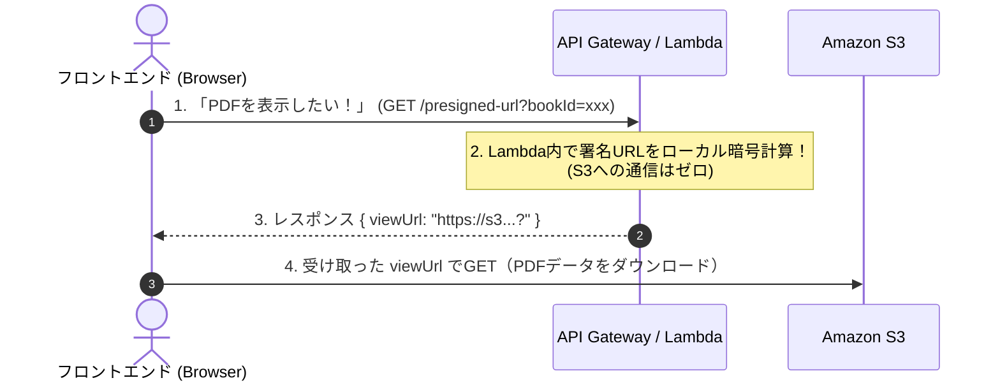
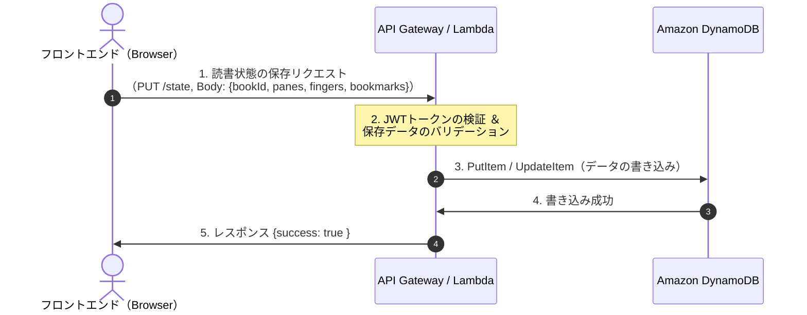
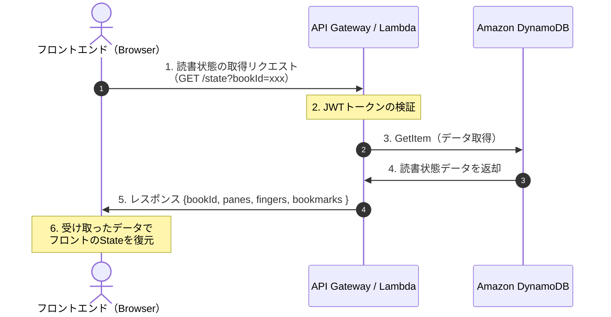

# FingerBookmark システムアーキテクチャ仕様書

## 目次
- [1.システム全体概要](#1-システム全体概要)
- [2.インフラ構成図](#2-インフラ構成図)
- [3.コンポーネント役割定義](#3-コンポーネント役割定義)
- [4.主要データフロー](#4-主要データフロー)
- [5.セキュリティ・認証境界](#5-セキュリティ・認証境界)

## 1. システム全体概要
- ユーザがアップロードしたPDFをAWS S3に保存し、PDFのしおり等の読書情報をDynamoDBに保存、WebブラウザからそれらバックエンドにアクセスしPDF読書体験をユーザに提供する。
- 既存のPDFリーダと異なり、複数ペインによる表示と「指」機能による素早く複数ページの切替体験を提供する。

## 2. インフラ構成図

## 3. コンポーネント役割定義

|コンポーネント|役割・責務|非担当範囲|
|-------------|---------|---------|
|Next.js Frontend|・画面UIの描画とユーザ操作の検知 ・「ペイン」「指」「しおり」のメモリ上での即時制御 ・pdf.jsを使ったPDFの高速レンダリング|・S3やDynamoDBへの直接アクセス|
|Amazon Cognito|・ユーザの新規登録、ログイン認証 ・安全なアクセス証明書（JWTトークン）の発行|・ビジネスロジックの処理|
|Amazon APIGateway|・フロントからのREST APIリクエスト受信 ・JWTトークンの検証（不正アクセスのブロック） ・CORS（クロスアクセスドメイン）の制御|・S3やDynamoDBへの直接アクセス|
|Amazon Lambda|・S3アップロード用の署名付きURLの発行 ・DynamoDBへの読書進捗情報の保存と取得|・UI描画情報の保持|
|Amazon S3|・ユーザがアップロードしたPDFファイルの保存|・読書状態の保存・取得 ・UIに関する情報の保存|
|Amazon DynamoDB|・ユーザごとの読書状態（ページ番号、指、しおり）のKeyValue保存|・PDFの保存|

## 4. 主要データフロー
### PDFアップロード

### PDFの閲覧取得

### 読書進捗・状態の保存（Save State）

### 読書進捗・状態の取得（Load State）

## 5. セキュリティ・認証境界
